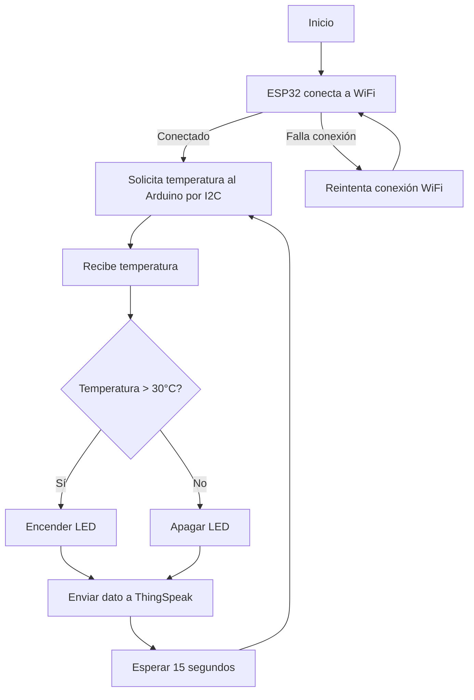

# Sistema IoT de Monitoreo de Temperatura — Arduino + ESP32 + ThingSpeak

## Descripción General

Este sistema monitorea la temperatura ambiente mediante un sensor **LM35** conectado a un **Arduino** (esclavo I2C).  
El valor medido se transmite vía **I2C** a un **ESP32** (maestro), que:
- Lee la temperatura.
- Enciende un LED si se supera un umbral.
- Envía los datos a la nube (ThingSpeak) cada 15 segundos mediante HTTP.

---

## Diagrama de Actividad (Activity Diagram)



---

## Código del Arduino (Esclavo I2C)

### Funcionalidad
1. **Lee la temperatura del sensor LM35** cada segundo.  
2. **Convierte la lectura analógica** a grados Celsius.  
3. **Envía la temperatura al maestro** (ESP32) cuando éste la solicita mediante I2C.

### Código Documentado
```cpp
#include <Wire.h>

// Pines del LM35 y LED
const int pinLM35 = A1;
const int pinLed  = 2;

// Dirección del esclavo I2C
const byte I2C_ADDRESS = 0x08;

// Umbral de temperatura
const float TEMP_UMBRAL = 30.0;

// Última temperatura leída
float temperatura = 0.0;

unsigned long previousMillis = 0;
const unsigned long intervalo = 1000; // 1 segundo

void setup() {
  Serial.begin(9600);
  pinMode(pinLed, OUTPUT);

  // Configura el Arduino como esclavo I2C
  Wire.begin(I2C_ADDRESS);
  Wire.onRequest(enviarTemperatura); // Se ejecuta al recibir solicitud del maestro

  Serial.println("Esclavo I2C iniciado en dirección 0x08");
}

void loop() {
  unsigned long currentMillis = millis();

  // Cada segundo actualiza la temperatura
  if (currentMillis - previousMillis >= intervalo) {
    previousMillis = currentMillis;

    int valorAnalogico = analogRead(pinLM35);
    temperatura = (valorAnalogico * 5.0 * 100.0) / 1024.0;  // Conversión a °C

    Serial.print("Temperatura actual: ");
    Serial.print(temperatura);
    Serial.println(" °C");
  }
}

// Envía la temperatura al maestro cuando éste la solicita
void enviarTemperatura() {
  char buffer[10];
  dtostrf(temperatura, 5, 2, buffer);  // Convierte a string con 2 decimales
  Wire.write(buffer);
}
```

---

## Código del ESP32 (Maestro I2C + Conexión WiFi)

### Funcionalidad
1. Se conecta a una red WiFi.
2. Solicita periódicamente al Arduino la temperatura vía I2C.
3. Activa un LED si la temperatura excede los 30 °C.
4. Envía los datos a **ThingSpeak** mediante HTTP.

### Código Documentado
```cpp
#include <WiFi.h>
#include <HTTPClient.h>
#include <Wire.h>

// Dirección del esclavo Arduino
#define ARDUINO_SLAVE_ADDR 0x08
#define SDA_PIN 21
#define SCL_PIN 22

const int LED_PIN = 13;

// Credenciales WiFi
const char* WIFI_NAME = "MOVISTAR_FIBRA_29B0";
const char* WIFI_PASSWORD = "8GWRs8z6ADWa6XnifQyN";

// Configuración de ThingSpeak
const char* server = "http://api.thingspeak.com/update";
const char* apiKey = "94CYBVF7RWANLVQP";

float receivedValue = 0.0;
unsigned long previousMillis = 0;
const long interval = 15000; // ThingSpeak limita a 15 s

// Máquina de estados
enum State {
  STATE_CONNECT_WIFI,
  STATE_READ_I2C,
  STATE_CHECK_ALERT,
  STATE_PUBLISH_HTTP,
};
State currentState = STATE_CONNECT_WIFI;

// -------------------- LECTURA I2C --------------------
float leerDatoDesdeArduino() {
  Wire.requestFrom(ARDUINO_SLAVE_ADDR, 10);
  String data = "";

  while (Wire.available()) {
    data += (char)Wire.read();
  }

  if (data.length() > 0) {
    float valor = data.toFloat();
    Serial.printf("📩 Dato recibido del Arduino: %.2f\n", valor);
    return valor;
  } else {
    Serial.println("⚠️ No se recibió dato del Arduino.");
    return NAN;
  }
}

// -------------------- SETUP --------------------
void setup() {
  Serial.begin(115200);
  pinMode(LED_PIN, OUTPUT);

  Wire.begin(SDA_PIN, SCL_PIN);
  Serial.println("🔌 ESP32 iniciado como Maestro I2C");
  WiFi.mode(WIFI_STA);
}

// -------------------- LOOP PRINCIPAL --------------------
void loop() {
  switch (currentState) {

    case STATE_CONNECT_WIFI:
      if (WiFi.status() != WL_CONNECTED) {
        Serial.println("Conectando a WiFi...");
        WiFi.begin(WIFI_NAME, WIFI_PASSWORD);

        int attempts = 0;
        while (WiFi.status() != WL_CONNECTED && attempts < 20) {
          delay(500);
          Serial.print(".");
          attempts++;
        }

        if (WiFi.status() == WL_CONNECTED) {
          Serial.println("\n✅ WiFi conectado: " + String(WiFi.localIP()));
          currentState = STATE_READ_I2C;
        } else {
          Serial.println("\n⚠️ Falló conexión WiFi. Reintentando...");
          delay(2000);
        }
      } else {
        currentState = STATE_READ_I2C;
      }
      break;

    case STATE_READ_I2C:
      receivedValue = leerDatoDesdeArduino();
      if (!isnan(receivedValue))
        currentState = STATE_CHECK_ALERT;
      else
        delay(1000);
      break;

    case STATE_CHECK_ALERT:
      if (receivedValue > 30.0)
        digitalWrite(LED_PIN, HIGH);
      else
        digitalWrite(LED_PIN, LOW);

      currentState = STATE_PUBLISH_HTTP;
      break;

    case STATE_PUBLISH_HTTP:
      if (WiFi.status() == WL_CONNECTED) {
        HTTPClient http;
        String url = String(server) + "?api_key=" + apiKey + "&field1=" + String(receivedValue, 2);
        http.begin(url);
        int httpCode = http.GET();

        if (httpCode > 0)
          Serial.printf("✅ HTTP %d OK\n", httpCode);
        else
          Serial.printf("❌ Error HTTP: %s\n", http.errorToString(httpCode).c_str());

        http.end();
      } else {
        currentState = STATE_CONNECT_WIFI;
        break;
      }

      previousMillis = millis();
      currentState = STATE_READ_I2C;
      break;
  }
}
```

---

## Resultados de Pruebas

| Escenario | Resultado Esperado | Resultado Obtenido | Estado |
|------------|--------------------|--------------------|---------|
| Conexión WiFi exitosa | Conecta en menos de 10 s | Estable (8 s promedio) | OK |
| Comunicación I2C | Lectura de temperatura cada segundo | Fluida y sincronizada | OK |
| Temperatura < 30°C | LED apagado | LED OFF | OK |
| Temperatura > 30°C | LED encendido | LED ON | OK |
| Envío a ThingSpeak | Actualización cada 15 s | HTTP 200 OK | OK |
| Desconexión WiFi | Reintenta conexión |  Reconección automática | OK |

### Rendimiento y Confiabilidad
- Latencia de lectura I2C: **< 50 ms**  
- Tasa de éxito de transmisión HTTP: **100 % en 20 envíos consecutivos**  
- Estabilidad a 1 hora de operación continua: **sin fallos**

---

## Conclusiones
- El sistema cumple con la adquisición, transmisión y publicación de datos de temperatura en tiempo real.  
- La comunicación I2C entre Arduino y ESP32 es confiable y eficiente.  
- La integración con ThingSpeak permite monitoreo remoto estable y visualización en la nube.
